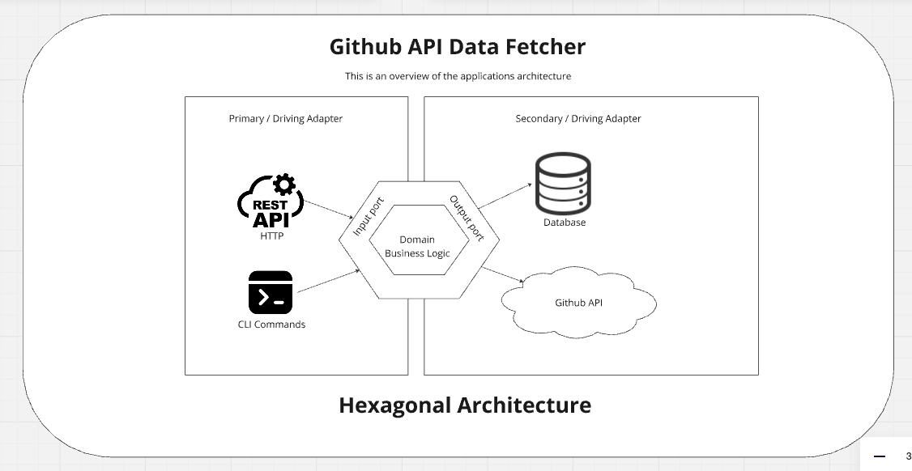

### GitHub API Data Fetcher
#### Overview
This project is a GitHub API data fetcher designed to retrieve repository and commit data, store it in a database, and monitor the repositories for new commits. It is structured using the Ports and Adapters (Hexagonal) architecture to ensure separation of concerns and easy maintainability.

#### Setup Instructions
##### Prerequisites
- Go (version 1.20)
- Docker
- Docker Compose

##### Installation
1. Clone the repository:

```
git clone git@github.com:oluwatobi1/gh-data-fetching.git
cd gh-data-fetching
```
2. Install dependencies:
```
go mod tidy
```
3. Setup environment variables (create a ./config/dev.env file based on ./configs/sample_env):

```
PORT=8000
ENVIRONMENT=debug
DB_URL=github_monitoring.db
DEFAULT_REPO=oluwatobi1/web-dev-BE
START_DATE=2024-08-02
END_DATE=2024-07-02
GITHUB_TOKEN=
```

##### Running the Application
1. Start the application using Docker Compose:
```
docker compose -f docker-compose.yaml build
docker compose -f docker-compose.yaml up
```
2. Alternatively, you can run the application directly:
```
go run cmd/main.go fetch-repo
```


#### Key Components
##### API Layer
**File**: _internal/adapter/api/github_api.go_

**GitHubAPI**: This struct handles the communication with the GitHub API.
**FetchRepository**(repoName string): Fetches the repository details from GitHub.
**FetchCommits**(repoName string, repoId uint, config models.CommitConfig): Fetches commits from GitHub based on the provided configuration.
GORM Layer
**File**: internal/adapter/db/gorm

**Repository**: Implements the repository operations.

**Create(repo *models.Repository):** Creates a new repository record.
**FindAll():** Retrieves all repositories.
**FindByName(name string):** Finds a repository by name.
**UpdateLastCommitSHA(id uint, sha string):** Updates the last commit SHA of a repository.
**Commit**: Implements the commit operations.

**Create(commit *models.Commit)**: Creates a new commit record.
**FindByHash(hash string):** Finds a commit by its hash.
**FindByRepoId(repoId uint):** Finds commits by repository ID.
**FindAll():** Retrieves all commits.


##### Event System
**File**: _internal/core/events/events.go_

Defines events such as AddCommitEvent and StartMonitorEvent used for the event-driven architecture.
**File**: _internal/services/event_bus.go_

**EventBus**: Handles the event publishing and subscribing mechanism.
#### Handlers
**File**: _internal/handlers/handlers.go_
**InitNewRepository:** Add a new repo to application Database if it doesn't exits, if it does, it starts monitoring the repo
***AppHandler**: Handles the business logic and interacts with the API and database layers.
**HandleAddCommitEvent**(event events.AddCommitEvent):** Handles the AddCommitEvent.
CommitManager(repo *models.Repository, config models.CommitConfig):** Manages the fetching and storing of commits.

#### Architecture Diagram


### Alternative  Link
Can't see image preview,open `./architecture_diagram.png`. file